# FusionSpace App

This is Collborative and Sharing Posts Application. This allow users to share posts in public and communities. User can create own communties. User can follow others and joins different communities.

## 🔥 Tech Stack

**Frontend**

- Developed Using React, Javascript
- State management with Context API
- API Calls using Axios
- Authentication with login/register funcationality
- UI state handling (loading, error, success)

**Backend**

- Built Using Node.js, Express, MongoDB
- Secure password hashing with bcryptjs
- Middleware for authentication and error handling
- Modular controller and route structure
- MongoDB database connnection using Mongoose

---

## ⚙️ Installation Steps

**Prerequisites**

Ensure you have **Node.js** installed.

Installation

```
git clone <repo-url>
npm install
```

**Configure Environment Variables**

Create a `.env` file in the directory and add the following. Put you values:

```
# If backend is running locally
VITE_API_URL="backend-url"

VITE_API_RENDER_URL="remote-backend-url"
```

**Run the App**

```
npm run dev
```

---

## 🎨 Design and Pages

### 🌐 Desktop Pages

| Home Page | Trending Page |
|----------|---------------|
| 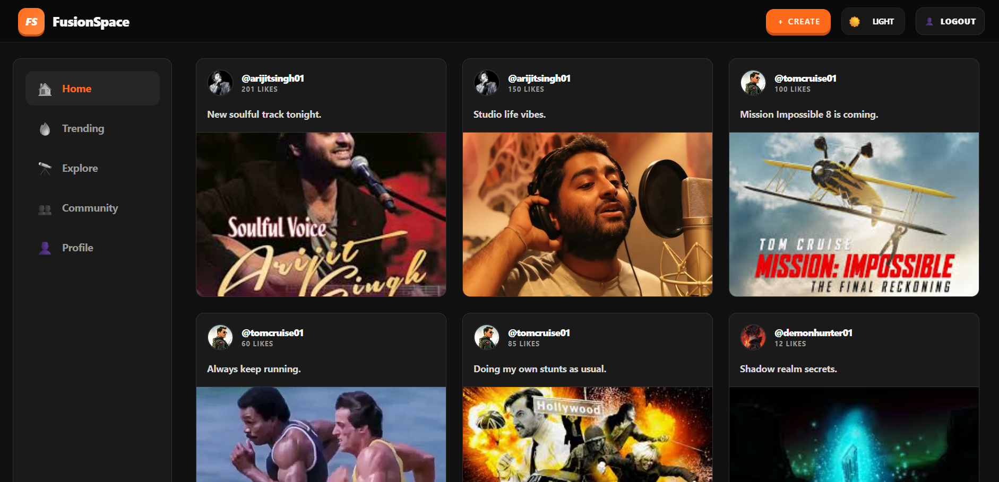 | 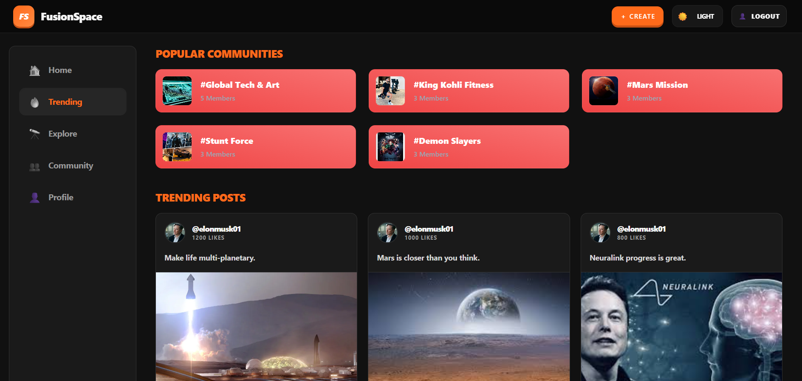 |

| Community Page | Profile Page |
|---------------|--------------|
| 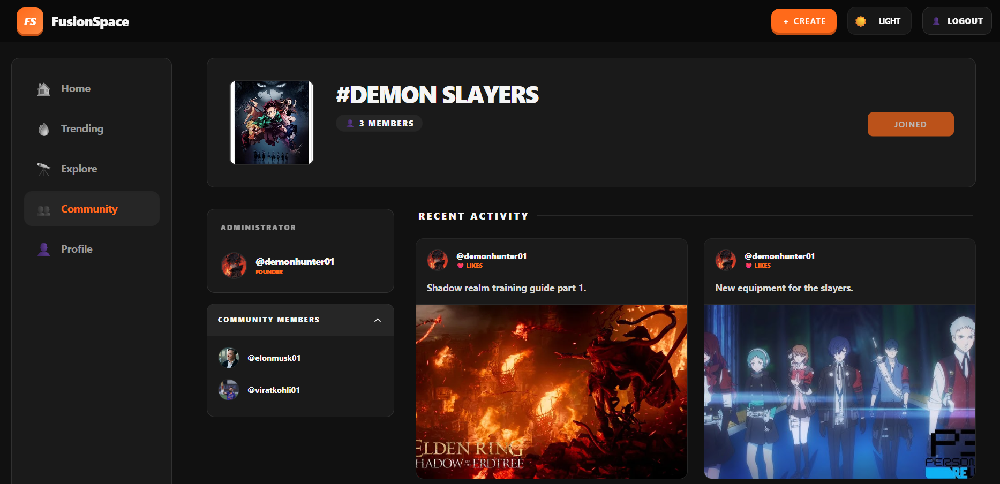 | 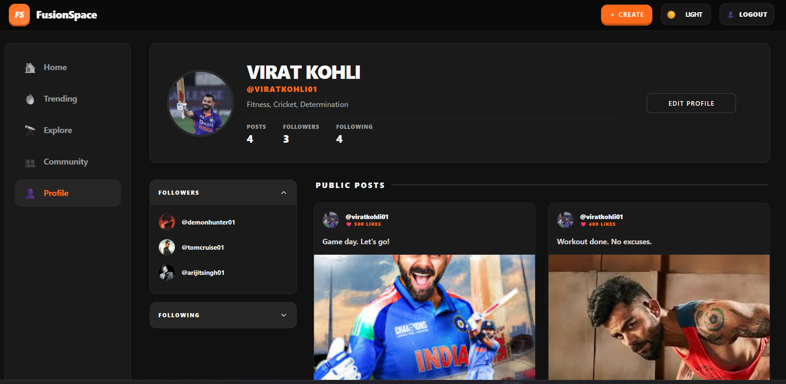 |

| Search Page | Post Page |
|------------|-----------|
| 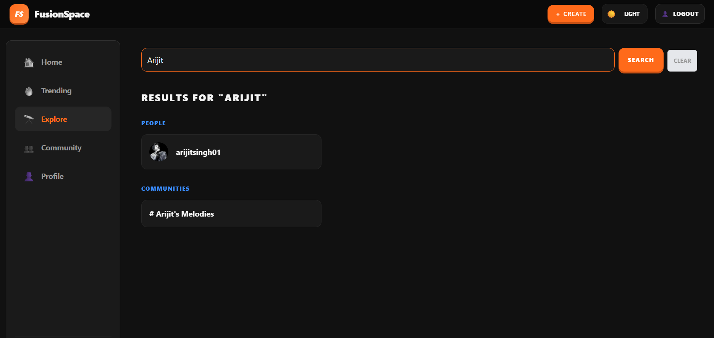 | 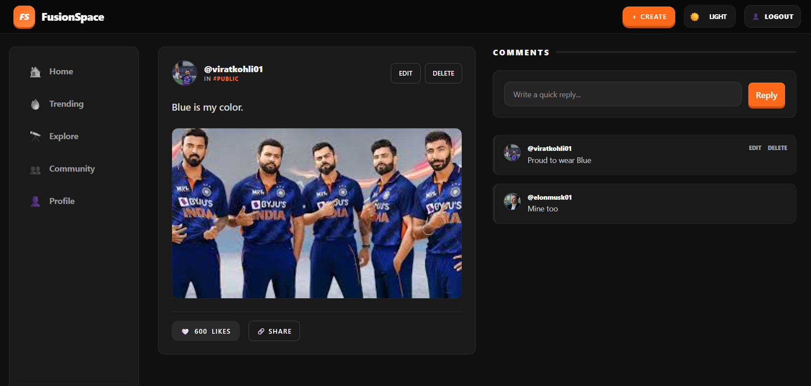 |

---

### 🔐 Form Pages

| Login Form | Signup Form |
|-----------|-------------|
| 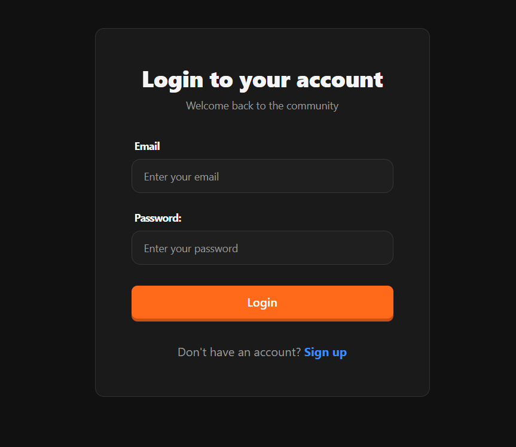 | 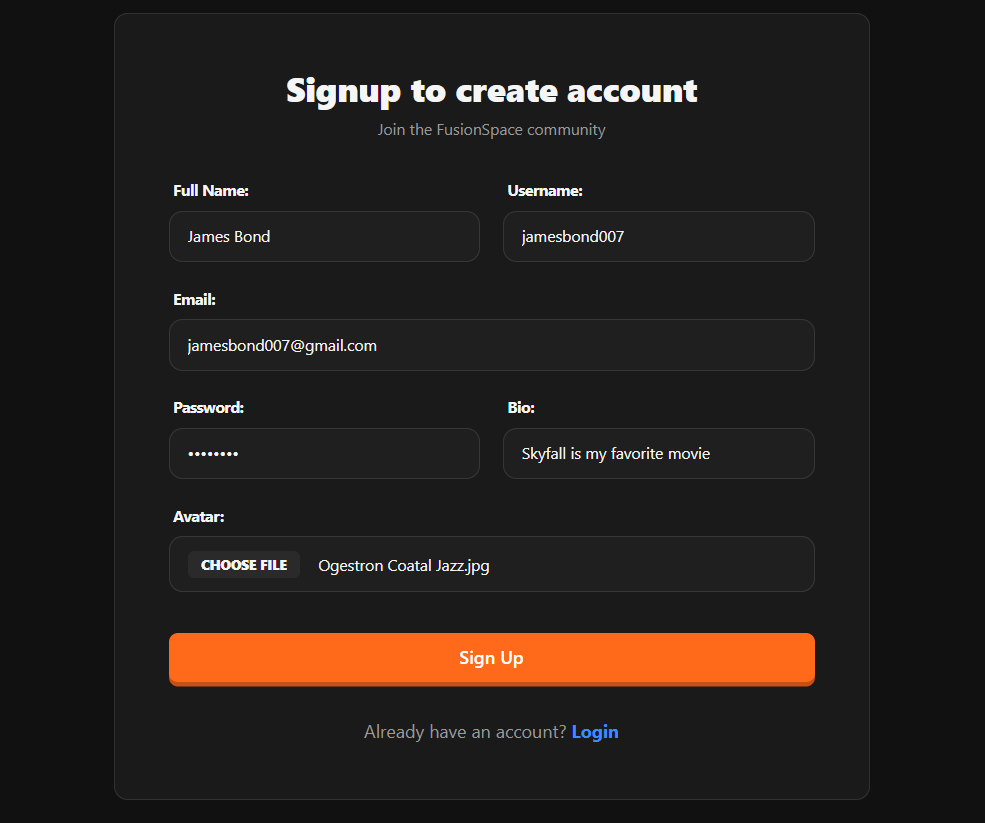 |

| Post Form | Community Form |
|----------|----------------|
| 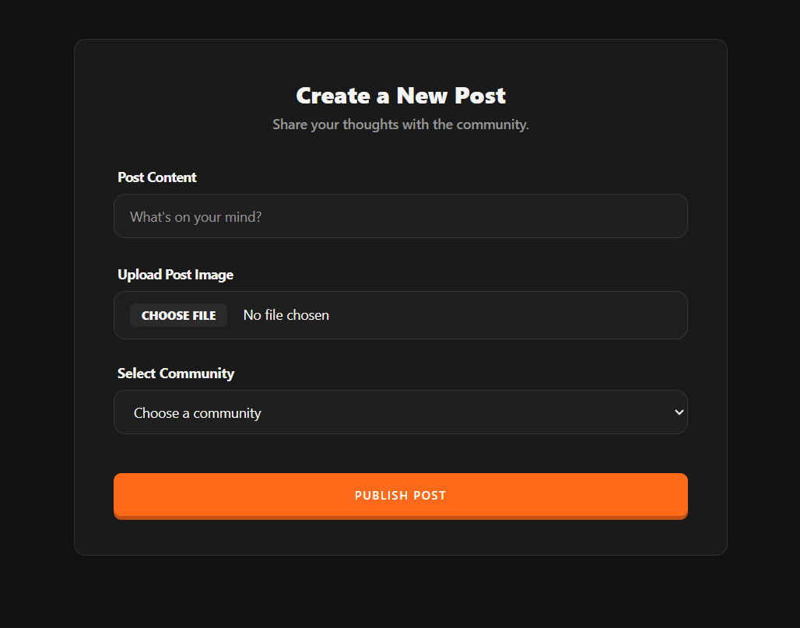 | 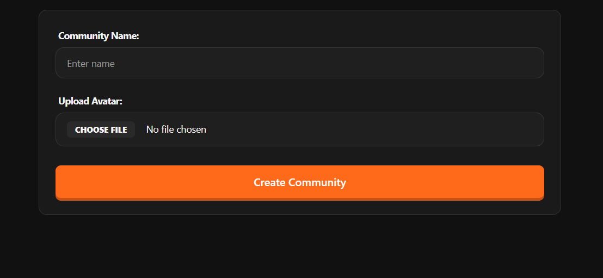 |

---

### 📱 Mobile Pages (Desktop View: 3 per row)

| Mobile Feed Page | Mobile Explore Page | Mobile Create Post |
|------------------|--------------------|--------------------|
| 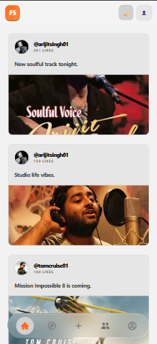 | 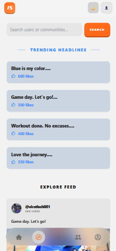 | 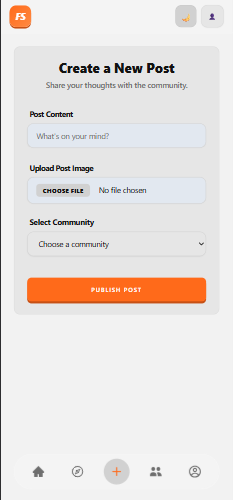 |

| Mobile Community Page | Mobile Profile Page | Mobile Post Page |
|----------------------|--------------------|------------------|
| 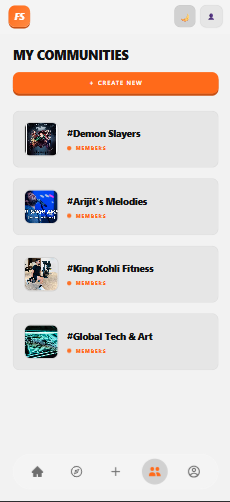 | 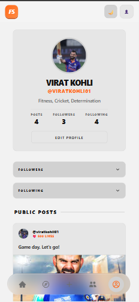 | 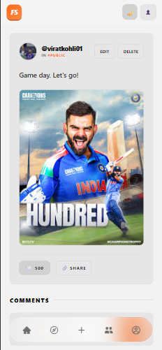 |

---

## Features Implements

    User Creation
    Post Creation
    Follow / Unfollow Users
    Create, Join, Delete Communities
    Like, Comment Posts
    Dark / Light Modes
    Search Users, Communities

---

## 🚀 Future Improvements

    Refresh token mechanism
    Chat Implementation
    OAuth (Google, GitHub) authentication
    Profile management (edit profile, upload avatars)
    Toast Notification
    Update Community

---

## Collaboration and contributions

    Feel Free to clone and use repo.
    Suggestions are accepted.

---

## 📝 License

This project is open-source and available under the MIT License.
